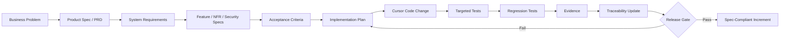

# Specs-Driven Development Operating Model

## Purpose
This repo teaches AI Forward Deployed Engineers to use Cursor as an engineering agent governed by explicit specifications rather than as a free-form code generator.

## Golden path

## Source-of-truth hierarchy
1. Approved product/system/feature specifications.
2. Approved ADRs and change requests.
3. Acceptance criteria and API/data contracts.
4. Implementation and tests.
5. Legacy behavior and historical baseline outputs.

Legacy tests are important but may preserve known defects. A green regression suite means compatibility with the baseline; it does **not** automatically mean compliance with the target business intent.

## Cursor execution loop
Use this sequence for every meaningful change:

**READ → TRACE → CHALLENGE → PLAN → TEST → IMPLEMENT → VERIFY → EVIDENCE → UPDATE**

### READ
Read the governing spec and the relevant code path.

### TRACE
Identify requirement IDs, acceptance criteria, affected interfaces and existing tests.

### CHALLENGE
Look for ambiguity, contradiction, missing policy, hidden assumptions or conflict with legacy behavior.

### PLAN
Produce a small implementation plan including files, tests, compatibility impact and rollback consideration.

### TEST
Create or update acceptance-oriented tests before or alongside implementation.

### IMPLEMENT
Make the minimum code change needed to satisfy the approved spec.

### VERIFY
Run targeted tests and the entire regression suite. Do not ignore failures.

### EVIDENCE
Capture commands run, test results, key decisions and residual risk.

### UPDATE
Update traceability and the spec/change record if scope or behavior changed.

## Participant rule
A participant may use Cursor to discover, reason, plan, generate, refactor and test. They may **not** use Cursor to invent unstated business policy and then silently encode it in code.
