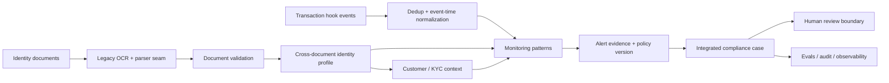

# Integrated Identity Verification + Compliance Monitoring Architecture

## System boundary
This repository models a synthetic retail-bank onboarding and ongoing-monitoring workflow. It is intentionally offline-capable and uses deterministic local implementations so workshops do not require cloud credentials.

## Brownfield contract
The inherited `/v1` endpoints stay operational. `/v2` adds identity-profile, transaction-monitoring and integrated compliance-case APIs. This forces additive modernization instead of a clean-sheet rewrite.

## Trust boundaries
1. OCR/document content is untrusted data.
2. Extracted identity fields require provenance.
3. Transaction hooks may be duplicated, late or malformed.
4. Policy and risk thresholds are versioned.
5. Final compliance escalation/closure remains a governed human/business process.
